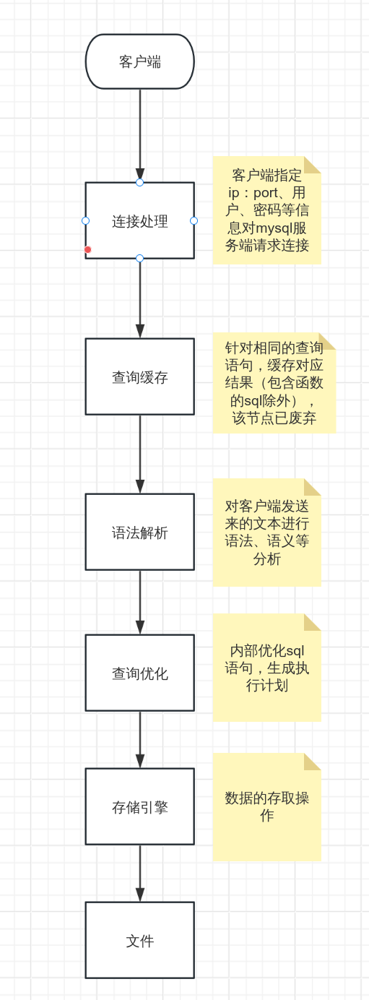
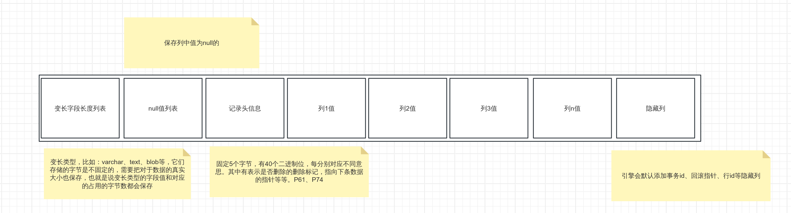
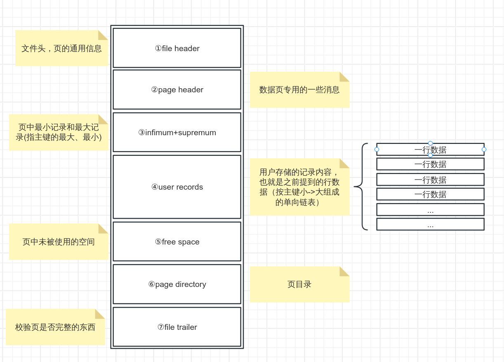
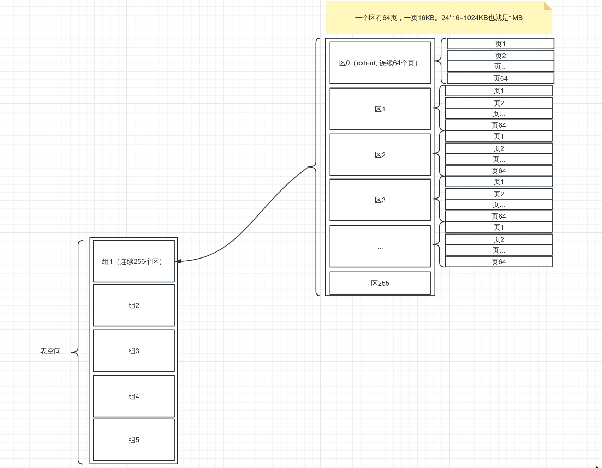

## 一、了解

### 1.架构
mysql是服务端-客户端的sc模式，通过 tcp/socket 等进行通信连接。

### 2.连接过程



### 3.配置

配置文件一般路径：/etc/my.cnf、/etc/mysql/my.cnf、～/.my.cnf
其中可配置多个组内容：

``` cnf
[server]
具体启动项

[mysqld]
...

[client]
...

[mysql]
...
```
具体配置很多，之后在收集

### 4.变量
也就是mysql的系统环境，比如最大连接数、默认引擎是什么等。有全局范围和会话范围就行，慢慢收集。

### 5.字符集

字符与二进制之间的映射集。比如最早的 ascii。mysql直接utf8mp4就行，其用1～4个字节表示一个字符。

### 6.比较规则

控制字符的大小、排序等。一般 utf8_xx_xx 格式。通用：utf8_general_ci：ci表示不区分大小写，genral表示通用，_cs就区分大小写。

注意点：mysql服务端和客户端都可以指定字符集、比较规则，使用时需要注意最好配置一致。


## 二、结构

> 默认都是指 innodb 存储引擎下的结构

### 1.行结构

P57

行结构也就是每条数据的格式（insert插入的内容在innodb中以怎样的格式存储），innodb中有四种行数据结构，这里只介绍 compact 一种。



### 2.页结构

P85

innodb 中磁盘和内存间数据交换的基本单位为页，一页大小16KB。也就是说使用innodb引擎的mysql,一次最少会把内存中的16KB数据刷新到硬盘中。

有很多种类型的页，其中存放真实数据的页称为索引页，或者直接说数据页吧。



> innodb 还会把 user records 中的行数据进行分组，把每组的最后一个地址偏移量保存到 page directory 中，查找数据时根据二分法确定到组，再遍历即可定位到主键数据。

### 3.文件

P140

上面说的都是mysql的结构，数据还是要以文件格式保存der,这些文件保存在哪？有什么特有后缀提供识别？

`show variables like 'datadir'`,文件就保存在这个目录下！

| 存储引擎      | 文件 |
| :---        |    :----:   |
| Innodb      |    表结构(表名.frm)、表数据（表名.idb）    |
| Myisam   | 表结构(表名.frm)、表数据(表名.myd)、表索引(表名.myi)、        |



上面是比较完整的数据结构图了，一堆结构，页里保存行，64个页组成区，不同区又可以分为碎片区、空闲区等，256个区又组成组等等。

通过这些骚结构，mysql实现了数据的高效处理（碎片管理、顺序io等等等）

### 4.索引

P90

类似页中给行分配组偏移量一样，索引是给页建立一个目录项。具体：b+树算法。（注意b+树不超过4层）

聚簇索引：叶子节点都存储完整的行数据（innodb自动创建），非叶子节点都按照主键排序。
二级索引：以非主键字段建立b+树，叶子节点存放主键，再根据主键去聚簇索引中找到完整数据。（回表）
联合索引：以多个非主键字段建立b+树，...

ps：联合索引的列值在b+树中的排序规则：先按列1值排序，列1值相同的情况下按照列2值排序，列1列2值相同的情况下再按列3值排序，...。所以如果只查询列2条件的话，并不会走联合索引哟。而存在联合索引的情况下，要避免创建重复索引，也就是不用单独给列1再各索引了，只查列1也会走联合索引der。

b+树的每个节点都是数据页，也就是默认都会占有16KB空间，所以创建索引有一定的空间代价;
而增删等操作都会影响b+的稳定，b+树需要重新排序，带来一定的时间代价。

### 5.索引应用

- 区间：=、in、not in、is null、is not null、>、<、!=、between、like等关键字产生的扫描区间，区间存在是为了减少遍历全部聚簇索引，根据条件确定区间即可减少查询次数。
- 排序：order by,对查询到的记录按照规则进行排序。如果是按照索引列排序，会减少回表操作，直接根据索引排序就行，但是要保证列排序规则要统一，asc-升序、desc-降序。如果是按联合索引排序，也要记得按索引中的列顺序哟。
    如果没用索引的情况下要怎么排序nie：把查到的记录放到内存中按规则一个个排呗，如果内存放不下就放磁盘，所以这效率是有点感人der
- 分组：group by,记录中相同的列合并成一个。如果分组字段多列的话，也要按联合索引顺序来写，因为联合索引保证了列1相同再到列2、列3,相同的列一眼丁真。
    如果不用索引的话，把记录取出来后先按列1进行分组，将相同的结果分组，再按列2进行分组，而且这些统计的结果都要保存到临时表中，所有分组操作结束后再把临时表的结果响应给到客户端，就问你麻不麻烦。

### 6.什么时候用索引

- 只为用于搜索、排序、分组的列创建索引。（也就是上面提到的那些关键字）
- 列值大多都是不重复的情况下，因为二级索引是为了减少回表的，如果值都相同，那还不如直接聚簇索引，全表扫描，还少走一遍二级索引。
- 索引的列值类型尽量小，类型越小，索引占有空间就越少，一个数据页存放的记录就越多，越高效。
- 前缀索引，经典右模糊
- 覆盖索引，查找的数据就是索引列的值，回表都不用回了。