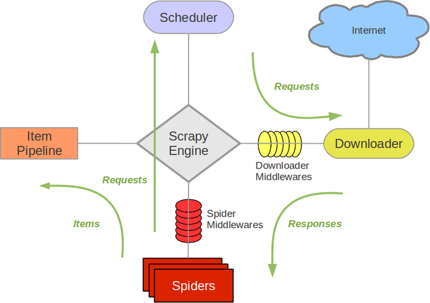

## 一、执行流程

{loading=lazy : .zoom}

- 组件说明
    - Scrapy Engine(引擎): 负责Spider、ItemPipeline、Downloader、Scheduler中间的通讯，信号、数据传递等。
    - Scheduler(调度器): 它负责接受引擎发送过来的Request请求，并按照一定的方式进行整理排列，入队，当引擎需要时，交还给引擎。
    - Downloader（下载器）：负责下载Scrapy Engine(引擎)发送的所有Requests请求，并将其获取到的Responses交还给Scrapy Engine(引擎)，由引擎交给Spider来处理，
    - Spider（爬虫）：它负责处理所有Responses,从中分析提取数据，获取Item字段需要的数据，并将需要跟进的URL提交给引擎，再次进入Scheduler(调度器).
    - Item Pipeline(管道)：它负责处理Spider中获取到的Item，并进行进行后期处理（详细分析、过滤、存储等）的地方。
    - Downloader Middlewares（下载中间件）：你可以当作是一个可以自定义扩展下载功能的组件。
    - Spider Middlewares（Spider中间件）：你可以理解为是一个可以自定扩展和操作引擎和Spider中间通信的功能组件（比如进入Spider的Responses;和从Spider出去的Requests）

- 执行流程说明：

    - 引擎：Hi！Spider, 你要处理哪一个网站？
    - Spider：老大要我处理xxxx.com。
    - 引擎：你把第一个需要处理的URL给我吧。
    - Spider：给你，第一个URL是xxxxxxx.com。
    - 引擎：Hi！调度器，我这有request请求你帮我排序入队一下。
    - 调度器：好的，正在处理你等一下。
    - 引擎：Hi！调度器，把你处理好的request请求给我。
    - 调度器：给你，这是我处理好的request
    - 引擎：Hi！下载器，你按照老大的下载中间件的设置帮我下载一下这个request请求
    - 下载器：好的！给你，这是下载好的东西。（如果失败：sorry，这个request下载失败了。然后引擎告诉调度器，这个request下载失败了，你记录一下，我们待会儿再下载）
    - 引擎：Hi！Spider，这是下载好的东西，并且已经按照老大的下载中间件处理过了，你自己处理一下（注意！这儿responses默认是交给def parse()这个函数处理的）
    - Spider：（处理完毕数据之后对于需要跟进的URL），Hi！引擎，我这里有两个结果，这个是我需要跟进的URL，还有这个是我获取到的Item数据。
    - 引擎：Hi ！管道 我这儿有个item你帮我处理一下！调度器！这是需要跟进URL你帮我处理下。然后从第四步开始循环，直到获取完老大需要全部信息。
    - 管道调度器：好的，现在就做！ 

注意！只有当调度器中不存在任何request了，整个程序才会停止，（也就是说，对于下载失败的URL，Scrapy也会重新下载。）


<!-- more -->

## 二、搭建环境

### 安装pyenv

``` shell
# 若提示访问raw网站失败，则复制内容到本地 pyenv-installer.sh ，再执行 `bash pyenv-installer.sh`
curl https://pyenv.run | bash
```

``` shell title="配置"
echo 'export PYENV_ROOT="$HOME/.pyenv"' >> ~/.bashrc
echo 'command -v pyenv >/dev/null || export PATH="$PYENV_ROOT/bin:$PATH"' >> ~/.bashrc
echo 'eval "$(pyenv init -)"' >> ~/.bashrc

echo 'export PYENV_ROOT="$HOME/.pyenv"' >> ~/.profile
echo 'command -v pyenv >/dev/null || export PATH="$PYENV_ROOT/bin:$PATH"' >> ~/.profile
echo 'eval "$(pyenv init -)"' >> ~/.profile
```

### 创建python环境

``` shell title="安装依赖"
sudo apt update
sudo apt install build-essential libssl-dev zlib1g-dev libbz2-dev libreadline-dev libsqlite3-dev curl git libncursesw5-dev xz-utils tk-dev libxml2-dev libxmlsec1-dev libffi-dev liblzma-dev
```

``` shell
pyenv install -v 3.10.6
pyenv virtualenv 3.10.6 spider
cd spider
pyenv local spider
python -V
```

### 安装scrapy依赖

``` shell
pip install scrapy selenium scrapy-selenium undetected-chromedriver nodriver
```

## 三、简单示例

- 1.创建项目
``` shell
# scrapy startproject myproject [project_dir] # 这将在 project_dir 目录下创建一个 Scrapy 项目，如果未指定 project_dir ，则 project_dir 将与 myproject 相同
scrapy startproject bilibili
```

- 2.创建spider
``` shell
scrapy genspider quotes_spider https://quotes.toscrape.com
# 或者直接在 spider 目录下创建文件
```
``` py title="vim bilibili/bilibili/spiders/quotes_spider.py"
from pathlib import Path

import scrapy


class QuotesSpider(scrapy.Spider):
    name = "quotes"
    start_urls = [
        "https://quotes.toscrape.com/page/1/",
    ]

    def parse(self, response):
        for quote in response.css("div.quote"):
            yield {
                "text": quote.css("span.text::text").get(),
                "author": quote.css("small.author::text").get(),
                "tags": quote.css("div.tags a.tag::text").getall(),
            }

        # next_page = response.css("li.next a::attr(href)").get()
        # if next_page is not None:
            # next_page = response.urljoin(next_page) # urljoin-补充请求前缀
            # yield scrapy.Request(next_page, callback=self.parse)

        # next_page = response.css("li.next a::attr(href)").get()
        # if next_page is not None:
            # yield response.follow(next_page, callback=self.parse) # response.follow 自动补全，返回的也是request
        
        # for href in response.css("ul.pager a::attr(href)"): # 分页 数组数据
            # yield response.follow(href, callback=self.parse) 

        # for a in response.css("ul.pager a"):   # 自动获取 属性值
            # yield response.follow(a, callback=self.parse)
        
        # anchors = response.css("ul.pager a")  # 分页 数组数据
        # yield from response.follow_all(anchors, callback=self.parse)

        yield from response.follow_all(css="ul.pager a", callback=self.parse)
```

- 执行爬虫
``` shell
# scrapy startproject myproject
scrapy crawl quotes
```

## 四、项目结构

``` shell
scrapy.cfg # 项目根目录下，项目配置文件
myproject/
    __init__.py
    items.py
    middlewares.py
    pipelines.py
    settings.py
    spiders/
        __init__.py
        spider1.py
        spider2.py
        ...
```

## 五、使用selenium

### 安装chrome

``` shell
wget https://dl.google.com/linux/direct/google-chrome-stable_current_amd64.deb
pkg -i google-chrome*.deb # 如果出错，执行下一个命令
apt-get install -f
```

### 安装chromedriver

https://googlechromelabs.github.io/chrome-for-testing/
``` shell
# 查看谷歌版本号
google-chrome --version
# 安装对应的驱动
wget https://storage.googleapis.com/chrome-for-testing-public/126.0.6478.62/linux64/chromedriver-linux64.zip
# 解压到python环境下
unzip -d ~/.pyenv/versions/spider/bin/ chromedriver-linux64.zip 
```

ref: 

- [scrapy-菜鸟教程](https://www.runoob.com/w3cnote/scrapy-detail.html){target=_blank}
- [scrapy-官方教程](https://docs.scrapy.org/en/latest/intro/tutorial.html){target=_blank}
- [无图形界面Linux安装chrome实现自动化测试](https://blog.csdn.net/qq_57457856/article/details/124823603){target=_blank}